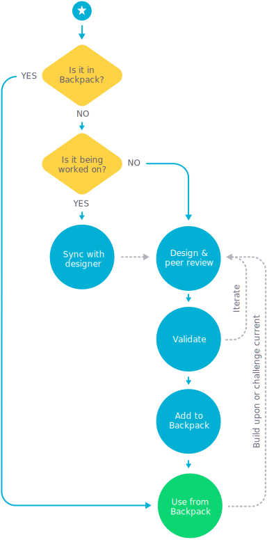

# Contributing to Backpack

So you want to help us enable Skyscanner to create beautiful, coherent products at scale? That's awesome! ♥

This document describes how to go about it. If you have any questions, get in touch on Slack in #backpack or via [backpack@skyscanner.net](mailto:backpack@skyscanner.net).

<!-- TOC depthFrom:2 depthTo:3 withLinks:1 updateOnSave:1 orderedList:0 -->

- [Before you jump into design and code](#before-you-jump-into-design-and-code)
- [Getting started](#getting-started)
- [Development tasks](#development-tasks)
- [Common changes](#common-changes)
	- [Adding tokens](#adding-tokens)
	- [Adding Sass mixins](#adding-sass-mixins)
	- [Adding a component](#adding-a-component)
	- [Documentation](#documentation)
- [Publishing packages (Backpack squad members only)](#publishing-packages-backpack-squad-members-only)

<!-- /TOC -->

## Before you jump into design and code

Is there something that you think should be in Backpack, but currently isn't? Before you dive in, please note that not everything that is a UI component belongs in Backpack.

> Is this really going to be used by multiple products?

If you use it multiple times yourself, it might as well be a component, but maybe Backpack is the wrong place for it and it should instead stay in your own codebase. If in doubt, don’t hesitate to get in touch with us!

> I’m sure this should be in Backpack!

Awesome! Take a look at the diagram below:



If you need to create a new component, make sure to get in touch with your squad’s designer. **If you don’t have access to a designer, get in touch with us or post into #design-general.**

* * *

When you are ready to jump into code, use the following workflow to add new components or change any existing ones:

1. Fork the repo
2. Create a new branch
3. Make your changes
4. Commit and push your new branch
5. Submit a [merge request](http://git.prod.skyscanner.local/backpack/backpack/merge_requests/)
6. Notify someone in the Backpack Design System squad or drop a note in #backpack

## Getting started

To get started run:

```sh
npm install
```

The Backpack repository is a **multi-package repository**. This means that, instead of having one code repository for each npm module, we manage all of Backpack’s npm modules in a single code repository.

The tool we use for managing this multi-repo is [Lerna](https://lernajs.io).

> Because we use Lerna to manage multiple packages in one repository,
> you'll also need to run `npm run bootstrap` anytime that you have changed the dependencies
> within a package. This is the equivalent to running `npm install` inside each of the package
> folders.

You can find the individual modules / packages inside the `packages/` folder.

## Development tasks

```sh
npm start           # Start development test harness complete with hot module reloading [HMR]
npm test            # Lints .js & .scss files and runs unit tests
npm run build       # Runs the build process for all packages
```

## Common changes

### Adding tokens

Tokens are defined in the `bpk-tokens` package under `src/base` (with the exception of product-specific tokens, which are in other subdirectories). Tokens come in two layers: In `aliases.json`, all base tokens are defined with concrete values, such as colors, numbers and sizes. The other files then map those aliases to tokens for specific elements in our Atomic Design system.

> You should probably not touch `aliases.json`, as our color palette or grid rarely changes.

Be aware that changing tokens will update *all* packages in the repository, as they all depend on `bpk-tokens`. Changing an existing token is almost always worth a "major" release, whereas adding a new token is usually a "minor" release.

#### Building

To build the tokens, run

```sh
npm run build:tokens
```

This will output different formats from the source JSON, for example Sass variables, a JavaScript module, Android and iOS resources.

### Adding Sass mixins

All Sass mixins are in the `bpk-mixins` package. It also exposes the Sass variables from the `bpk-tokens` package via the `_bonds.scss` file.

If you add a new file to group mixin, for example for a new Atom, make sure you add the file to the imports in `_index.scss`.

#### Linting

To lint the Sass, run

```sh
npm run lint:scss
```

### Adding a component

Each component has its own subdirectory `packages/bpk-component-<component-name>`. For it to be properly published, create a `package.json` starting at version `0.0.0` and take inspiration from existing packages in terms of structure.

### Documentation

Our documentation consists of two parts: [Sassdoc](http://backpack.prod.aws.skyscnr.com/sassdoc/), which is automatically generated from the `bpk-mixin` sources, and the main [documentation](http://backpack.prod.aws.skyscnr.com/).

#### Sassdoc

As mentioned, the Sassdoc are automatically generated from source and comments. If you want to double check, you can generate them using `npm run sassdoc` and start a static server to browse the docs, but usually this is not necessary.

Take a look at some of the mixin source files to see how to annotate your Sass to generate proper Sassdoc.

#### Backpack documentation

The Backpack documentation is a standalone client-side app. Each package has its own “page”, which you can find and edit in the `bpk-docs` package under `src/pages`.

The “page” modules themselves contain introductory blurbs and examples for the respective component. They also import the component’s README, which should contain a code example and a table with props, their proptypes and defaults.

You can run the docs app locally using:

```sh
npm run docs
```

## Publishing packages (Backpack squad members only)

- Update the [changelog](/changelog.md) with every package that has changed, separating out breaking changes (*major*), additions (*minor*) and fixes (*patch*) changes (you should see examples of this in previous entries). Make sure to add
  them at the top under a heading of “UNRELEASED"
  - Some useful commands for determining "what's changed?":
    - `npm run lerna updated`
    - `npm run lerna diff <package-name>`
- Make sure you are an owner of the npm packages (speak to a member of the Backpack squad)
- **Do not run `npm publish`. Instead, run `npm run publish`** (this will run `lerna publish`).
- You’ll be asked to specify a new version for every package that has changed. Options are *patch*, *minor* or *major*. These should directly align to the entries you put in the changelog in step 1.
- You’ll be asked at the end to confirm. Note you can still exit without making these changes.
- Update the changelog with the package versions and update the title with today’s date and a brief summary of what has changed.
- Commit and push to master.
- Update the #backpack Slack channel if necessary.
