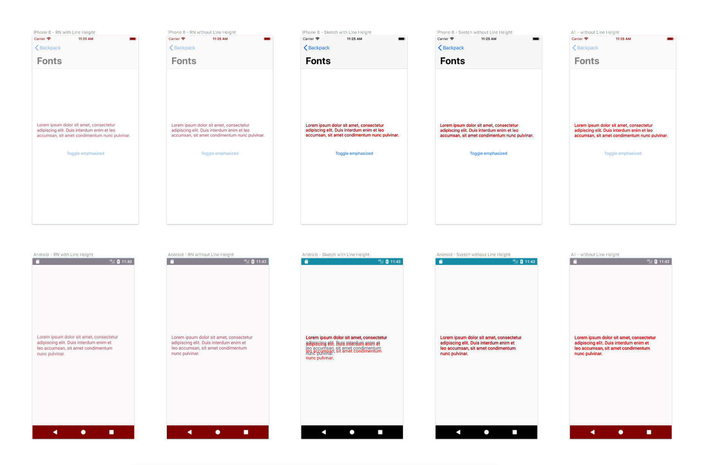

# We don't set line heights for native typography

## Decision

For React Native, Android, and iOS we do not set the line heights of text. Instead we set only the font size and rely on the font and text rendering to set the appropriate line height.

## Thinking

Our research shows that this method best aligns the React Native and Sketch text rendering with Android and iOS respectively.

Platform comparisons:

