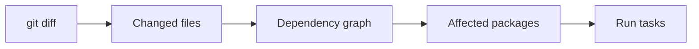

# CI/CD Guide with Nx

Complete guide to Continuous Integration and Continuous Deployment using Nx in Backpack.

## Overview

Backpack's CI/CD pipelines use Nx to optimize build and test execution:
- **PR Validation**: Uses `nx affected` to run only for changed code
- **Main Branch**: Uses `nx run-many --all` for full validation
- **Releases**: Full build with Nx parallelization
- **Performance**: 40-80% faster CI for typical PRs

## CI Workflows

### Pull Request Validation (pr.yml)

**Purpose**: Validate PR changes before merge

**Strategy**: Affected detection
```yaml
# Fetch base branch for comparison
- run: git fetch origin main:main --depth=1

# Build only affected packages
- run: npx nx affected --target=build --base=origin/main --parallel=4

# Test only affected packages
- run: npx nx affected --targets=lint,stylelint,test --base=origin/main --parallel=4
```

**Benefits**:
- Faster feedback (1-2 min for small changes vs 5-10 min)
- Lower CI costs
- Encourages frequent commits

**Workflow steps**:
1. Install dependencies (cached)
2. Build affected packages
3. Run typecheck
4. Run lint + test on affected
5. Build Storybook (cached)
6. Run Percy tests
7. Run Danger checks
8. Deploy Storybook preview

### Main Branch Build (main.yml)

**Purpose**: Validate main branch after merge

**Strategy**: Full build
```yaml
# Build all packages
- run: npx nx run-many --target=build --all --parallel=4

# Test all packages
- run: npm run test
```

**Benefits**:
- Ensures full integration
- Catches issues missed by affected
- 20-30% faster than before (parallel=4)

**Workflow steps**:
1. Install dependencies (cached)
2. Build all packages
3. Run full test suite
4. Build Storybook
5. Deploy Storybook to production

### Release Build (release.yml)

**Purpose**: Build and publish packages

**Strategy**: Full build
```yaml
# Build all packages for publishing
- run: npm run build

# Build Storybook
- run: npx nx storybook:build

# Publish to npm
- run: npm publish
```

**Benefits**:
- Reliable full build
- Nx parallelization (20-30% faster)
- Storybook caching

## Affected Detection

### How It Works

Nx compares current branch against base branch to determine affected packages:



**Example**:
1. You change `packages/bpk-component-button/src/BpkButton.tsx`
2. Nx detects `bpk-component-button` changed
3. Nx finds packages that depend on it
4. Runs build/test only for affected packages

### Base Branch Configuration

PR workflows fetch the base branch:
```yaml
- name: Fetch base branch
  if: github.event_name == 'pull_request'
  run: git fetch origin ${{ github.base_ref }}:${{ github.base_ref }} --depth=1
```

This allows Nx to compare:
- **Base**: `origin/main`
- **Head**: Current PR commit

### Affected vs All

| Scenario | Command | When |
|----------|---------|------|
| PR validation | `nx affected` | Changes to specific packages |
| Main branch | `nx run-many --all` | After merge to main |
| Release | `nx run-many --all` | Creating release |
| Infrastructure change | `nx affected` (becomes all) | Root config changed |

## Performance Optimization

### Parallelization

All Nx commands use `--parallel=4`:
```yaml
npx nx affected --target=build --parallel=4
```

**Why 4**:
- Testing showed 45% improvement over parallel=3
- parallel=5 showed no additional benefit
- Balances performance with resource usage

### Caching

**What's cached**:
- Package builds (`nx build`)
- Storybook builds (`nx storybook:build`)
- Percy runs (`nx percy`)

**Cache scope**:
- Local: Within single CI run
- No remote cache (Nx Cloud not enabled)

**Cache effectiveness**:
- Storybook: 99%+ (60-90s → <1s)
- Package builds: Varies by change size
- Tests: Cache hit when no code changed

## Common Scenarios

### Scenario 1: Small Component Update

**Change**: Update single component
```
Modified: packages/bpk-component-button/src/BpkButton.tsx
```

**CI behavior**:
```bash
# Affected detection
Affected projects:
- bpk-component-button

# CI runs
nx affected --target=build  # Builds 1 package
nx affected --target=test   # Tests 1 package

# Time: ~1-2 minutes (vs 5-10 min)
```

### Scenario 2: Shared Utility Update

**Change**: Update shared utility
```
Modified: packages/bpk-react-utils/src/Portal.js
```

**CI behavior**:
```bash
# Affected detection
Affected projects:
- bpk-react-utils
- bpk-component-modal (depends on Portal)
- bpk-component-popover (depends on Portal)
- ... (5-10 packages total)

# CI runs
nx affected --target=build  # Builds 5-10 packages
nx affected --target=test   # Tests 5-10 packages

# Time: ~2-4 minutes (vs 5-10 min)
```

### Scenario 3: Root Config Change

**Change**: Update tsconfig.json
```
Modified: tsconfig.json
```

**CI behavior**:
```bash
# Affected detection
Affected projects: All (91 packages)

# CI runs
nx affected --target=build  # Builds all packages
nx affected --target=test   # Tests all packages

# Time: ~5-10 minutes (same, but better parallelization)
```

### Scenario 4: Documentation Only

**Change**: Update README
```
Modified: README.md
```

**CI behavior**:
```bash
# Affected detection
Affected projects: None

# CI runs
Minimal checks only (no build/test needed)

# Time: <1 minute
```

## CI Commands Reference

### Build Commands
```bash
# PR: Build affected packages
npx nx affected --target=build --base=origin/main --parallel=4

# Main: Build all packages
npx nx run-many --target=build --all --parallel=4

# Single package
npx nx build bpk-component-button
```

### Test Commands
```bash
# PR: Test affected packages (lint + stylelint + jest)
npx nx affected --targets=lint,stylelint,test --base=origin/main --parallel=4

# Main: Test all packages
npm run test  # Runs lint + stylelint + jest

# Single package
npx nx test bpk-component-button
npx nx lint bpk-component-button
npx nx stylelint bpk-component-button
```

### Storybook Commands
```bash
# Build Storybook (with caching)
npx nx storybook:build

# Percy tests (auto-builds Storybook if needed)
npx nx percy
```

### Utility Commands
```bash
# See what's affected
npx nx print-affected --base=origin/main

# View affected graph
npx nx affected:graph --base=origin/main

# Reset cache
npx nx reset
```

## Monitoring CI Performance

### GitHub Actions Metrics

**View CI duration**:
1. Go to PR → "Checks" tab
2. Look at workflow run time
3. Compare with baseline (before Nx)

**Typical improvements**:
- Small change: 60-80% faster
- Medium change: 40-60% faster
- Large change: 0-20% faster

### Nx Output in CI

**Affected detection**:
```
NX  Running target build for 3 projects:
  - bpk-component-button
  - bpk-component-card
  - bpk-component-modal
```

**Cache hits**:
```
NX  Successfully ran target build for 3 projects

Nx read the output from the cache instead of running the command for 1 out of 3 tasks.
```

**Performance summary**:
```
NX  Successfully ran target build for 91 projects (5.2s)
```

## Troubleshooting

### All Packages Affected (PR)

**Problem**: `nx affected` detects all packages for small change

**Possible causes**:
1. Root config file changed (tsconfig.json, package.json, etc.)
2. Base branch not fetched correctly
3. Git history issues

**Solution**:
```bash
# Check what changed
git diff origin/main

# Verify base branch exists
git branch -a | grep main

# Check Nx affected calculation
npx nx print-affected --base=origin/main
```

### CI Failing on Affected Command

**Problem**: `nx affected` command fails in CI

**Common issues**:

**Base branch not found**:
```yaml
# Solution: Ensure fetch step runs
- name: Fetch base branch
  run: git fetch origin main:main --depth=1
```

**Wrong base ref**:
```yaml
# Use github.base_ref for PRs
--base=origin/${{ github.base_ref }}
```

### Performance Not Improving

**Problem**: CI not faster after Nx

**Check**:
1. Is `nx affected` actually running?
   ```
   # Look for in CI logs:
   "nx affected --target=build"
   ```

2. Are packages actually affected?
   ```
   # Check affected count in logs:
   "Running target build for X projects"
   ```

3. Is parallelization working?
   ```
   # Should see:
   "--parallel=4"
   ```

**Solution**: Review workflow configuration and Nx output

### Cache Not Working

**Problem**: No cache hits in CI

**Expected behavior**:
- CI cache is local to each run
- Without Nx Cloud, cache doesn't persist between runs
- Still get parallelization benefits

**Future**: Can enable Nx Cloud for remote caching

## CI Best Practices

### 1. Use Affected for PRs
```yaml
# Good: Fast feedback
npx nx affected --target=test

# Avoid: Unnecessary work
npx nx run-many --target=test --all
```

### 2. Use All for Main/Release
```yaml
# Good: Full validation
npx nx run-many --target=build --all

# Avoid: Might miss issues
npx nx affected --target=build
```

### 3. Specify Base Branch
```yaml
# Good: Explicit comparison
--base=origin/main

# Avoid: Implicit default
nx affected --target=build
```

### 4. Monitor Performance
- Track CI duration trends
- Compare with baseline
- Report improvements to team

### 5. Keep Workflows Simple
- Use clear naming
- Document changes
- Maintain rollback ability

## Future Enhancements

### Nx Cloud (Optional)

**Benefits**:
- Remote cache shared across CI runs
- Developers can use CI cache locally
- Distributed task execution
- CI analytics

**When to consider**:
- Team size grows (>20 people)
- CI costs become significant
- Need distributed builds

**How to enable**:
Contact Banana team for Skyscanner enterprise Nx Cloud access

### CI Optimization

**Potential improvements**:
- Separate lint/test jobs (parallel execution)
- Matrix builds for different scenarios
- Conditional Percy runs (visual changes only)

## Resources

- **Command Mapping**: `docs/nx-migration/ci-command-mapping.md`
- **Affected Commands**: `docs/nx-migration/affected-commands.md`
- **Performance Plan**: `docs/nx-migration/performance-testing-plan.md`
- **Quick Reference**: `docs/nx-migration/quick-reference.md`
- **Nx CI Docs**: https://nx.dev/ci/intro/ci-with-nx
