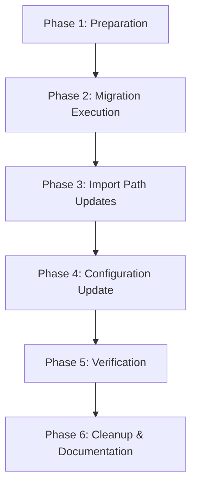

<!--
==============================================================================
DOCUMENT PURPOSE: Executable Tasks for M3: Storybook Colocation
==============================================================================

This task list provides specific, actionable steps for implementing M3
(Storybook Colocation) in the Backpack repository.

FOCUS: STEPS (What to do, in what order)
- Specific actions with file paths
- Commands to run
- Verification steps
- Execution order

AUTOMATION:
- Auto-generated by `/speckit.tasks` from M3 plan.md and spec.md
- Organized by implementation phase

VALIDATION:
- Each task should be executable independently (or with stated dependencies)
- Commands should be copy-pasteable
- Verification criteria should be clear
==============================================================================
-->

# Tasks: M3 - Storybook Colocation

**Input**: Design documents from `/specs/003-nx-migration/milestones/`
**Prerequisites**: M3-plan.md (implementation plan), M3-storybook-colocation.md (specification), M3-research.md

**Backpack Context**: This milestone moves Storybook stories from the separate `examples/` directory to colocate with their respective components in `packages/`.

**Tests**: No new test files required for M3. Verification is done via Storybook build and visual inspection.

**Organization**: Tasks are grouped by implementation phase to enable clear progress tracking.

## Format: `[ID] [P?] Description`

- **[P]**: Can run in parallel (different files, no dependencies)
- Include exact file paths and commands

## Summary

| Phase | Task Count | Parallel Tasks |
|-------|------------|----------------|
| Phase 1: Preparation | 4 | 2 |
| Phase 2: Migration Execution | 3 | 0 |
| Phase 3: Import Path Updates | 3 | 0 |
| Phase 4: Configuration Update | 3 | 0 |
| Phase 5: Verification | 6 | 4 |
| Phase 6: Cleanup & Documentation | 5 | 3 |
| **Total** | **24** | **9** |

---

## Phase 1: Preparation

**Purpose**: Establish baseline and create migration tooling

**⚠️ CRITICAL**: Must complete before moving any files

- [X] T001 Count and document current story count for validation baseline
  ```bash
  find examples -name "stories.tsx" | wc -l
  ```
  **Expected**: 92 story files
  **Verify**: Record the exact count for post-migration comparison

- [X] T002 Verify Storybook builds successfully before migration
  ```bash
  npm run storybook:dist
  ```
  **Verify**: Build completes with exit code 0, output in `dist-storybook/`

- [X] T003 [P] Create migration script at `scripts/migrate-stories.sh`

  Create `/Users/chloehe/Documents/code/backpack/scripts/migrate-stories.sh`:
  ```bash
  #!/usr/bin/env bash
  # Migrate stories from examples/ to packages/
  # M3: Storybook Colocation

  set -e

  echo "Starting story migration from examples/ to packages/..."

  for dir in examples/bpk-*; do
    component=$(basename "$dir")
    target="packages/$component/src"

    if [ -d "$target" ]; then
      echo "Moving $component stories..."

      # Move story files
      [ -f "$dir/stories.tsx" ] && mv "$dir/stories.tsx" "$target/"
      [ -f "$dir/examples.tsx" ] && mv "$dir/examples.tsx" "$target/"

      # Move style files (both .scss and .css)
      for scss in "$dir"/*.module.scss "$dir"/*.module.css; do
        [ -f "$scss" ] && mv "$scss" "$target/"
      done
    else
      echo "WARNING: Target directory $target does not exist for $component"
    fi
  done

  echo "Migration complete!"
  ```
  **Verify**: Script file exists at `/Users/chloehe/Documents/code/backpack/scripts/migrate-stories.sh`

- [X] T004 [P] Make migration script executable
  ```bash
  chmod +x scripts/migrate-stories.sh
  ```
  **Verify**: `ls -la scripts/migrate-stories.sh` shows execute permission

**Checkpoint**: Baseline established, migration script ready

---

## Phase 2: Migration Execution

**Purpose**: Move all story files to their new locations

**⚠️ CRITICAL**: Sequential execution required - each step depends on previous

- [X] T005 Run migration script to move all story files
  ```bash
  ./scripts/migrate-stories.sh
  ```
  **Verify**: Script completes without errors, outputs list of moved components

- [X] T006 Verify story count after migration
  ```bash
  find packages -path "*/src/stories.tsx" | wc -l
  ```
  **Expected**: Same count as T001 (92 story files)
  **Verify**: Count matches baseline from Phase 1

- [X] T007 Verify examples directory is now empty or contains only non-story files
  ```bash
  find examples -name "*.tsx" -o -name "*.scss" -o -name "*.css" 2>/dev/null | wc -l
  ```
  **Expected**: 0 (all story-related files moved)
  **Verify**: No .tsx, .scss, or .css files remain in examples/

**Checkpoint**: All story files moved to packages/*/src/

---

## Phase 3: Import Path Updates

**Purpose**: Fix import paths in all moved story files

**⚠️ CRITICAL**: Stories will not render until imports are fixed

- [X] T008 Create and run import path fix script for stories.tsx files

  Create `/Users/chloehe/Documents/code/backpack/scripts/fix-story-imports.sh`:
  ```bash
  #!/usr/bin/env bash
  # Fix import paths in moved story files
  # M3: Storybook Colocation

  set -e

  echo "Fixing import paths in stories.tsx files..."

  for story in packages/*/src/stories.tsx; do
    if [ -f "$story" ]; then
      echo "Fixing: $story"
      # Replace ../../packages/bpk-component-X with ../index
      sed -i '' "s|from '../../packages/bpk-[^']*'|from '../index'|g" "$story"
      # Also handle double-quoted imports
      sed -i '' 's|from "../../packages/bpk-[^"]*"|from "../index"|g' "$story"
    fi
  done

  echo "Fixing import paths in examples.tsx files..."

  for example in packages/*/src/examples.tsx; do
    if [ -f "$example" ]; then
      echo "Fixing: $example"
      # Replace ../../packages/bpk-component-X with ../index
      sed -i '' "s|from '../../packages/bpk-[^']*'|from '../index'|g" "$example"
      # Also handle double-quoted imports
      sed -i '' 's|from "../../packages/bpk-[^"]*"|from "../index"|g' "$example"
    fi
  done

  echo "Import path fixes complete!"
  ```

  Then run:
  ```bash
  chmod +x scripts/fix-story-imports.sh
  ./scripts/fix-story-imports.sh
  ```
  **Verify**: Script completes without errors

- [X] T009 Fix SCSS import paths in story style files

  Create `/Users/chloehe/Documents/code/backpack/scripts/fix-scss-imports.sh`:
  ```bash
  #!/usr/bin/env bash
  # Fix SCSS import paths in moved story style files
  # M3: Storybook Colocation

  set -e

  echo "Fixing SCSS import paths in story style files..."

  for scss in packages/*/src/*Story.module.scss; do
    if [ -f "$scss" ]; then
      echo "Fixing: $scss"
      # Update paths from ../../../packages/X to ./X or ../bpk-mixins
      sed -i '' "s|../../../packages/|../|g" "$scss"
    fi
  done

  echo "SCSS import path fixes complete!"
  ```

  Then run:
  ```bash
  chmod +x scripts/fix-scss-imports.sh
  ./scripts/fix-scss-imports.sh
  ```
  **Verify**: Script completes without errors

- [X] T010 Manually review and fix any remaining broken imports
  ```bash
  # Check for any remaining old-style imports
  grep -r "../../packages/bpk-" packages/*/src/stories.tsx packages/*/src/examples.tsx 2>/dev/null || echo "No old imports found"
  grep -r "../../../packages/" packages/*/src/*.module.scss 2>/dev/null || echo "No old SCSS imports found"
  ```
  **Expected**: "No old imports found" for both checks
  **Verify**: No remaining old-style import paths

**Checkpoint**: All import paths updated to new relative locations

---

## Phase 4: Configuration Update

**Purpose**: Update Storybook configuration to find stories in new locations

**⚠️ CRITICAL**: Storybook will not find stories until config is updated

- [X] T011 Update Storybook main.ts configuration

  Update `/Users/chloehe/Documents/code/backpack/.storybook/main.ts`:

  **Before** (find this line):
  ```typescript
  stories: ['../examples/**/stories.@(ts|tsx|js|jsx)']
  ```

  **After** (replace with):
  ```typescript
  stories: ['../packages/**/src/stories.@(ts|tsx|js|jsx)']
  ```

  **Verify**: File saved, no syntax errors

- [X] T012 Verify Storybook configuration syntax is valid
  ```bash
  # TypeScript check on Storybook config
  npx tsc --noEmit .storybook/main.ts 2>/dev/null || echo "Config syntax check passed"
  ```
  **Verify**: No TypeScript errors in Storybook config

- [X] T013 Verify Nx Storybook plugin configuration (if present)
  ```bash
  grep -A5 "storybook" nx.json || echo "No Storybook plugin config in nx.json"
  ```
  **Verify**: If Storybook plugin is configured in nx.json, paths are still valid

**Checkpoint**: Storybook configured to find stories in new locations

---

## Phase 5: Verification

**Purpose**: Verify all stories work correctly after migration

**⚠️ CRITICAL**: ALL verification steps must pass before proceeding

- [X] T014 Build Storybook to verify configuration works
  ```bash
  npm run storybook:dist
  ```
  **Verify**: Build completes with exit code 0, no errors

- [X] T015 [P] Verify final story count matches baseline
  ```bash
  find packages -path "*/src/stories.tsx" | wc -l
  ```
  **Expected**: 92 (same as T001)
  **Verify**: Count matches pre-migration baseline

- [ ] T016 [P] Run TypeScript type checking
  ```bash
  npm run typecheck
  ```
  **Verify**: No new TypeScript errors introduced by migration

- [ ] T017 [P] Run ESLint on moved files
  ```bash
  npm run lint
  ```
  **Verify**: No new lint errors in story files

- [ ] T018 [P] Start Storybook dev server and manually verify stories render
  ```bash
  npm run storybook
  ```
  **Manual Verification**:
  - [ ] Storybook opens in browser
  - [ ] Navigation shows all component categories
  - [ ] Sample stories from different categories render correctly
  - [ ] Interactive controls work
  - [ ] Docs pages render correctly

  **Verify**: All stories visible and functional in Storybook UI

- [ ] T019 Run Percy visual regression tests (if available)
  ```bash
  npm run percy-test || echo "Percy tests not configured"
  ```
  **Verify**: No unexpected visual regressions (or Percy not configured)

**Checkpoint**: All stories verified working in new locations

---

## Phase 6: Cleanup & Documentation

**Purpose**: Remove old examples directory and update documentation

- [ ] T020 Remove empty examples directory
  ```bash
  # First verify it's empty
  ls -la examples/

  # If empty, remove it
  rm -rf examples/
  ```
  **Verify**: `examples/` directory no longer exists

- [ ] T021 [P] Update any documentation references to old story locations

  Check and update these files if they reference `examples/`:
  ```bash
  grep -r "examples/bpk-" README.md CONTRIBUTING.md docs/ 2>/dev/null || echo "No references found"
  ```
  **Verify**: No documentation references old `examples/` path

- [ ] T022 [P] Update any CI workflow references to old paths
  ```bash
  grep -r "examples/" .github/workflows/ 2>/dev/null || echo "No CI references found"
  ```
  **Verify**: No CI workflows reference old `examples/` path

- [ ] T023 [P] Commit changes with conventional commit message
  ```bash
  git add -A
  git status
  ```

  **Commit**:
  ```bash
  git commit -m "feat(storybook): colocate stories with components (M3)

  - Move all stories from examples/ to packages/*/src/
  - Update import paths in story and example files
  - Update Storybook config to find stories in new locations
  - Remove empty examples/ directory

  This improves developer experience by placing documentation
  next to implementation. Stories are now easier to find and
  maintain, and Nx can better analyze project dependencies.

  BREAKING CHANGE: None - Storybook continues to work unchanged

  Refs: UP-341"
  ```
  **Verify**: Commit created successfully

- [ ] T024 Push branch and create PR (or add to existing PR)
  ```bash
  git push origin 003-nx-migration-milestone1
  ```

  **PR Description** (if creating new PR):
  ```markdown
  ## Summary

  - Move 92 story directories from `examples/` to `packages/*/src/`
  - Update import paths in all story files
  - Update Storybook configuration
  - Remove empty `examples/` directory

  ## Test plan

  - [ ] `npm run storybook:dist` succeeds
  - [ ] Story count is 92 (same as before migration)
  - [ ] All stories render correctly in Storybook UI
  - [ ] `npm run typecheck` passes
  - [ ] `npm run lint` passes
  - [ ] CI pipeline passes

  🤖 Generated with [Claude Code](https://claude.com/claude-code)
  ```
  **Verify**: Changes pushed, CI pipeline triggered

**Checkpoint**: Migration complete, changes committed and ready for review

---

## Dependencies & Execution Order

### Phase Dependencies



### Task Dependencies

| Task | Depends On | Blocks |
|------|------------|--------|
| T001-T002 | None | T003-T004 |
| T003-T004 | T001-T002 | T005 |
| T005-T007 | T004 | T008 |
| T008-T010 | T007 | T011 |
| T011-T013 | T010 | T014 |
| T014-T019 | T013 | T020 |
| T020-T024 | T019 | None |

### Parallel Opportunities

**Phase 1**: T003, T004 can run in parallel after T001-T002
**Phase 5**: T015, T016, T017, T018 can run in parallel after T014
**Phase 6**: T021, T022, T023 can run in parallel

---

## Success Criteria

Before merging, verify ALL of these pass:

- [ ] All 92 story directories migrated to `packages/*/src/`
- [ ] `npm run storybook:dist` succeeds
- [ ] All stories visible in Storybook UI
- [ ] No visual regressions (Percy)
- [ ] `npm run typecheck` passes
- [ ] `npm run lint` passes
- [ ] `examples/` directory removed
- [ ] `.storybook/main.ts` updated
- [ ] CI pipeline passes
- [ ] No changes to consumer import paths (`@skyscanner/backpack-web/...`)

---

## Rollback Plan

If issues arise after migration:

```bash
# Revert all changes
git checkout HEAD~1 -- examples/ packages/ .storybook/main.ts

# Or if committed, revert the commit
git revert <commit-sha>

# Reinstall dependencies and verify
npm ci
npm run storybook:dist
```

---

## Risks & Mitigations

| Risk | Impact | Likelihood | Mitigation |
|------|--------|------------|------------|
| Import paths break | Storybook fails to build | High | Automated import fix scripts (T008-T009) |
| Missing stories | Documentation gaps | Medium | Story count verification (T006, T015) |
| Style imports break | Visual bugs | Medium | SCSS import fix script (T009) |
| Percy baseline shift | CI failures | Low | Update Percy baselines if needed |

---

## Notes

- **No new tests required**: M3 is verified via Storybook build and visual inspection
- **Zero breaking changes**: Consumer imports unchanged (`@skyscanner/backpack-web/...`)
- **File count**: ~184 files moved (stories.tsx + examples.tsx per component) + ~100 style files
- **Foundation for M4**: Stories colocated before components become Nx projects

## References

- **M3 Specification**: `specs/003-nx-migration/milestones/M3-storybook-colocation.md`
- **M3 Implementation Plan**: `specs/003-nx-migration/milestones/M3-plan.md`
- **M3 Research**: `specs/003-nx-migration/milestones/M3-research.md`
- **Storybook CSF Documentation**: [Component Story Format](https://storybook.js.org/docs/react/api/csf)
- **Nx Storybook Plugin**: [Nx Storybook](https://nx.dev/recipes/storybook/overview-react)
