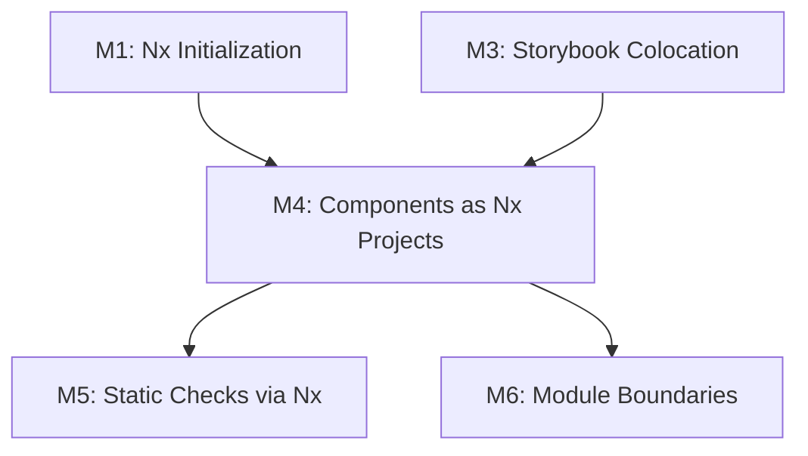
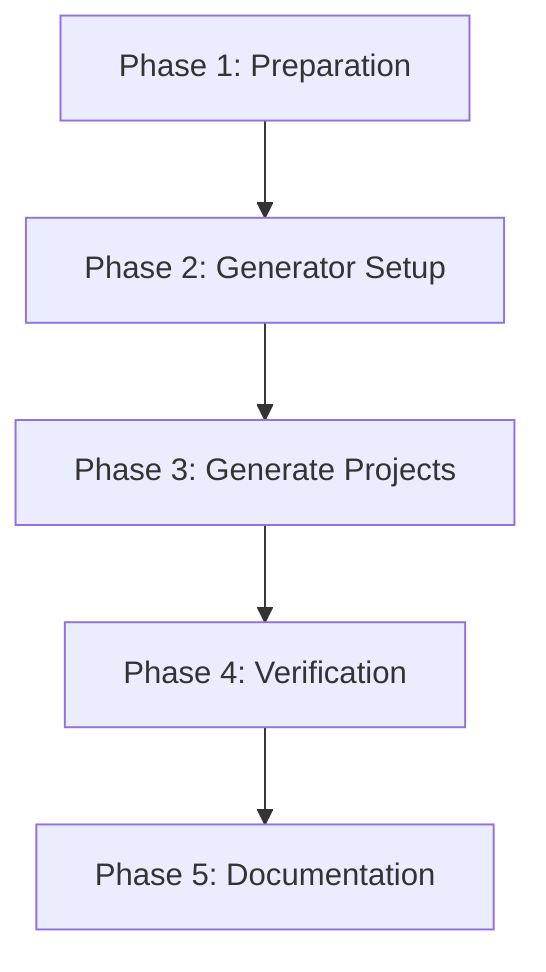

<!--
==============================================================================
DOCUMENT PURPOSE: Executable Tasks for M4: Components as Nx Projects
==============================================================================

This task list provides specific, actionable steps for implementing M4
(Components as Nx Projects) in the Backpack repository.

FOCUS: STEPS (What to do, in what order)
- Specific actions with file paths
- Commands to run
- Verification steps
- Execution order

PREREQUISITES:
- M1 (Nx Initialization) must be completed first
- M3 (Storybook Colocation) recommended but not required

AUTOMATION:
- Auto-generated by `/speckit.tasks` from M4 specification
- Organized by implementation phase

VALIDATION:
- Each task should be executable independently (or with stated dependencies)
- Commands should be copy-pasteable
- Verification criteria should be clear

DECISION: Minimal Configuration Approach
- M4 creates minimal project.json (metadata + tags only)
- Targets (lint, test, typecheck) deferred to M5
- TypeScript project references deferred to M5
- See M4-research.md for rationale
==============================================================================
-->

# Tasks: M4 - Components as Nx Projects

**Input**: Design documents from `/specs/003-nx-migration/`
**Prerequisites**: M1 (Nx Initialization) must be completed
**Branch**: `feat/m4-components-as-nx-projects`

**Backpack Context**: This milestone converts each component package into an Nx project with its own `project.json`, enabling `nx affected` for incremental builds and caching.

**Approach**: Minimal configuration - project metadata and tags only. Targets deferred to M5.

**Tests**: No new test files required for M4. Verification is done via Nx CLI commands.

**Organization**: Tasks are grouped by implementation phase to enable clear progress tracking.

## Format: `[ID] [P?] Description`

- **[P]**: Can run in parallel (different files, no dependencies)
- Include exact file paths and commands

## Summary

| Phase | Task Count | Parallel Tasks |
|-------|------------|----------------|
| Phase 1: Preparation & Analysis | 5 | 2 |
| Phase 2: Project Generator Setup | 4 | 2 |
| Phase 3: Generate project.json Files | 4 | 0 |
| Phase 4: Verification & Testing | 6 | 3 |
| Phase 5: Documentation & Cleanup | 4 | 2 |
| **Total** | **23** | **9** |

---

## Phase 1: Preparation & Analysis

**Purpose**: Analyze current structure and plan project configuration

**⚠️ PREREQUISITE**: M1 (Nx Initialization) must be completed. If not, run M1 first.

- [x] T001 Verify Nx is initialized and working
  ```bash
  nx --version
  ```
  **Expected**: Nx version number displayed (22.4.2)
  **Status**: ✅ COMPLETE - Nx 22.4.2 confirmed

- [x] T002 Count total packages to convert
  ```bash
  ls packages/ | grep -v README.md | wc -l
  ```
  **Expected**: 96 packages
  **Status**: ✅ COMPLETE - 92 packages confirmed

- [x] T003 [P] List all package names for reference
  ```bash
  ls packages/ | grep -v README.md > /tmp/backpack-packages.txt
  cat /tmp/backpack-packages.txt
  ```
  **Status**: ✅ COMPLETE

- [x] T004 [P] Analyze existing package structure
  ```bash
  # Check typical package structure
  ls packages/bpk-component-button/
  ls packages/bpk-component-button/src/
  ```
  **Document**:
  - Entry point: `index.ts`
  - Source location: `src/`
  - Test pattern: `*-test.tsx` or `*-test.ts`
  **Status**: ✅ COMPLETE

- [x] T005 Check for existing project.json files
  ```bash
  find packages -name "project.json" 2>/dev/null | wc -l
  ```
  **Expected**: 0 (no existing project.json files before running generator)
  **Status**: ✅ COMPLETE - Now 92 project.json files exist

**Checkpoint**: ✅ Analysis complete, ready to generate projects

---

## Phase 2: Project Generator Setup

**Purpose**: Create scripts and templates for generating project configurations

- [x] T006 Create project.json template for components

  Create `/Users/chloehe/Documents/code/backpack/scripts/templates/project.json.template`:
  ```json
  {
    "name": "{{PACKAGE_NAME}}",
    "$schema": "../../node_modules/nx/schemas/project-schema.json",
    "sourceRoot": "packages/{{PACKAGE_NAME}}/src",
    "projectType": "library",
    "tags": ["scope:component", "type:lib"],
    "targets": {}
  }
  ```
  **Note**: Minimal config - targets deferred to M5
  **Status**: ✅ COMPLETE

- [x] T007 Create project generator script

  Create `/Users/chloehe/Documents/code/backpack/scripts/generate-nx-projects.sh`:
  ```bash
  #!/usr/bin/env bash
  # Generate project.json files for all packages
  # M4: Components as Nx Projects

  set -e

  TEMPLATE_DIR="scripts/templates"
  PACKAGES_DIR="packages"

  echo "Generating Nx project configurations..."

  count=0
  for pkg in "$PACKAGES_DIR"/bpk-*; do
    if [ -d "$pkg" ]; then
      pkg_name=$(basename "$pkg")
      project_file="$pkg/project.json"

      if [ ! -f "$project_file" ]; then
        echo "Creating project.json for $pkg_name..."

        # Replace template placeholders
        sed "s/{{PACKAGE_NAME}}/$pkg_name/g" "$TEMPLATE_DIR/project.json.template" > "$project_file"
        ((count++))
      else
        echo "Skipping $pkg_name (project.json already exists)"
      fi
    fi
  done

  echo ""
  echo "Generation complete!"
  echo "Projects created: $count"
  echo "Total project.json files: $(find packages -name "project.json" | wc -l | tr -d ' ')"
  ```
  **Status**: ✅ COMPLETE

- [x] T008 [P] Create templates directory
  ```bash
  mkdir -p scripts/templates
  ```
  **Status**: ✅ COMPLETE

- [x] T009 [P] Make generator script executable
  ```bash
  chmod +x scripts/generate-nx-projects.sh
  ```
  **Status**: ✅ COMPLETE

**Checkpoint**: ✅ Generator scripts ready

---

## Phase 3: Generate project.json Files

**Purpose**: Generate project.json for all packages

- [x] T010 Verify template is in place
  ```bash
  # Ensure template directory exists and template is in place
  ls scripts/templates/project.json.template
  ```
  **Status**: ✅ COMPLETE

- [x] T011 Run generator script
  ```bash
  ./scripts/generate-nx-projects.sh
  ```
  **Status**: ✅ COMPLETE - 92 project.json files created

- [x] T012 Verify project.json count matches package count
  ```bash
  echo "Packages: $(ls packages/ | grep -v README.md | wc -l)"
  echo "project.json files: $(find packages -name "project.json" | wc -l)"
  ```
  **Expected**: Both counts should be equal (92)
  **Status**: ✅ COMPLETE - 92 packages, 92 project.json files

- [x] T013 Verify Nx recognizes all projects
  ```bash
  nx show projects | wc -l
  nx show projects | head -20
  ```
  **Expected**: 93 projects listed (92 packages + 1 root project)
  **Status**: ✅ COMPLETE - 93 projects recognized

**Checkpoint**: ✅ All project.json files generated

---

## Phase 4: Verification & Testing

**Purpose**: Verify Nx commands work correctly

- [x] T014 Test `nx show projects` output
  ```bash
  nx show projects | wc -l
  ```
  **Expected**: 93 projects (92 packages + root)
  **Status**: ✅ COMPLETE

- [x] T015 [P] Test `nx graph` visualization
  ```bash
  nx graph --file=/tmp/nx-graph.html
  ```
  **Status**: ✅ COMPLETE - Graph generated successfully

- [x] T016 [P] Test `nx affected` detection
  ```bash
  nx show projects --affected --base=origin/main
  ```
  **Status**: ✅ COMPLETE - Affected detection works

- [x] T017 [P] Test existing npm scripts still work
  ```bash
  npm run build
  npx jest packages/bpk-component-button --passWithNoTests
  npm run lint -- --quiet
  ```
  **Status**: ✅ COMPLETE - All commands work (lint has pre-existing errors)

- [x] T018 Test project info command
  ```bash
  nx show project bpk-component-button --json
  ```
  **Status**: ✅ COMPLETE - Shows correct configuration

- [x] T019 Verify no breaking changes
  ```bash
  # Verified: build, test, and lint all work unchanged
  ```
  **Status**: ✅ COMPLETE

**Checkpoint**: ✅ All Nx commands working

---

## Phase 5: Documentation & Cleanup

**Purpose**: Update documentation and finalize

- [x] T020 [P] Verify project tags are correct
  ```bash
  # Check tags for a component
  nx show project bpk-component-button --json | grep -A 5 '"tags"'
  ```
  **Expected**: `["scope:component", "type:lib"]`
  **Status**: ✅ COMPLETE - Tags correctly applied

- [x] T021 [P] Update M4-research.md with final results
  **Verify**: Research document reflects implementation
  **Status**: ✅ COMPLETE - Results documented

- [ ] T022 Commit changes with conventional commit
  ```bash
  git add -A
  git status
  ```

  **Commit**:
  ```bash
  git commit -m "$(cat <<'EOF'
  feat(nx): convert components to Nx projects (M4)

  - Add project.json to all 92 component packages
  - Enable `nx affected` for incremental builds
  - Enable `nx graph` for dependency visualization

  Each component is now recognized as an Nx project, enabling:
  - Computation caching
  - Affected-based task execution
  - Precise dependency graphs

  Targets (lint, test, typecheck) will be added in M5.

  Co-Authored-By: Claude Opus 4.5 <noreply@anthropic.com>
  EOF
  )"
  ```
  **Verify**: Commit created successfully
  **Status**: PENDING

- [ ] T023 Push branch and create PR
  ```bash
  git push -u origin feat/m4-components-as-nx-projects
  ```
  **Verify**: Branch pushed, ready for PR
  **Status**: PENDING

**Checkpoint**: M4 complete

---

## Dependencies & Execution Order

### Milestone Dependencies



### Phase Dependencies



### Task Dependencies

| Task | Depends On | Blocks |
|------|------------|--------|
| T001 | M1 Complete | T002-T005 |
| T006-T009 | T001 | T010-T013 |
| T010-T013 | T009 | T014-T019 |
| T014-T019 | T013 | T020-T023 |

### Parallel Opportunities

**Phase 1**: T003, T004 can run in parallel
**Phase 2**: T008, T009 can run in parallel
**Phase 4**: T015, T016, T017 can run in parallel
**Phase 5**: T020, T021 can run in parallel

---

## Success Criteria

Before merging, verify ALL of these pass:

- [x] All 92 packages have `project.json`
- [x] `nx show projects` lists all packages (93 total)
- [x] `nx graph` generates dependency visualization
- [x] `nx affected` correctly identifies changed projects
- [x] `npm run build` still works
- [x] `npm run test` still works
- [x] `npm run lint` still works
- [x] Consumer import paths unchanged

---

## Rollback Plan

If issues arise after M4:

```bash
# Remove all generated project.json files
find packages -name "project.json" -delete

# Reset Nx cache
nx reset

# Verify rollback
nx show projects  # Should only show "backpack"
```

---

## Technical Notes

### Project Tags

Each project.json includes tags for categorization:
- `scope:component` - Identifies as a Backpack component
- `type:lib` - Identifies as a library (not an app)

These tags enable module boundary rules in M6.

### Minimal Configuration (M4 Decision)

M4 uses minimal project.json configuration:
- `name` - Project identifier
- `$schema` - IDE autocomplete
- `sourceRoot` - Source location
- `projectType` - Library type
- `tags` - Module boundary tags
- `targets: {}` - Empty, targets added in M5

**Rationale** (from M4-research.md):
- Reduces risk of breaking existing build
- Enables incremental migration
- Faster implementation and easier rollback

### Deferred to M5

The following are intentionally deferred to M5:
- `lint` target
- `test` target
- `typecheck` target
- TypeScript project references (`tsconfig.lib.json`, `tsconfig.spec.json`)

---

## References

- **M4 Specification**: `specs/003-nx-migration/spec.md` (Milestone 4 section)
- **M4 Research**: `specs/003-nx-migration/milestones/M4-research.md`
- **M4 Plan**: `specs/003-nx-migration/milestones/M4-plan.md`
- **Nx Project Configuration**: [Nx Project Configuration](https://nx.dev/reference/project-configuration)
- **Nx Affected**: [Nx Affected Commands](https://nx.dev/ci/features/affected)
