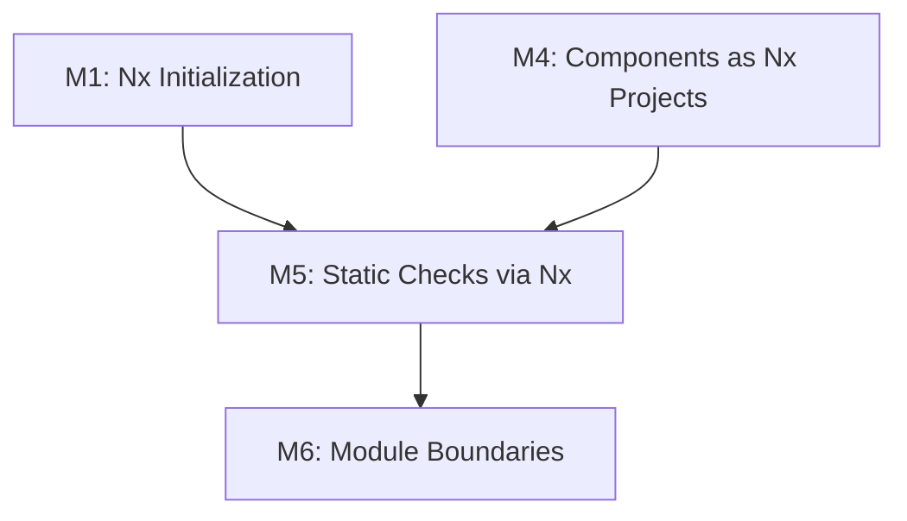
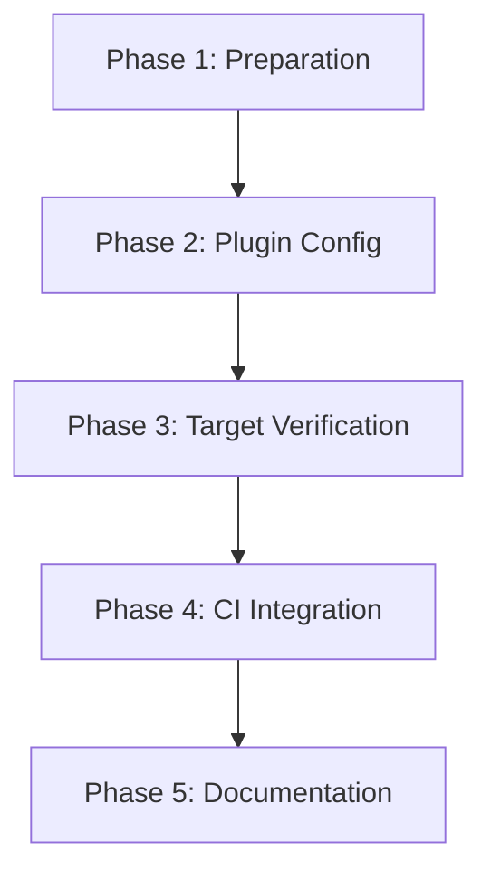

<!--
==============================================================================
DOCUMENT PURPOSE: Executable Tasks for M5: Static Checks via Nx
==============================================================================

This task list provides specific, actionable steps for implementing M5
(Static Checks via Nx) in the Backpack repository.

FOCUS: STEPS (What to do, in what order)
- Specific actions with file paths
- Commands to run
- Verification steps
- Execution order

PREREQUISITES:
- M1 (Nx Initialization) must be completed
- M4 (Components as Nx Projects) must be completed

AUTOMATION:
- Auto-generated by `/speckit.tasks` from M5 specification

VALIDATION:
- Each task should be executable independently (or with stated dependencies)
- Commands should be copy-pasteable
- Verification criteria should be clear

KEY INSIGHT:
- Nx plugins (@nx/jest/plugin, @nx/eslint/plugin) can infer targets automatically
- This means we DON'T need to add targets to each project.json manually
- We just need to configure the plugins and verify they work
==============================================================================
-->

# Tasks: M5 - Static Checks via Nx

**Input**: Design documents from `/specs/003-nx-migration/`
**Prerequisites**: M1 (Nx Initialization) and M4 (Components as Nx Projects) must be completed
**Branch**: `feat/m5-static-checks-via-nx`

**Backpack Context**: This milestone configures all static checks (lint, test, typecheck) to run through Nx, enabling incremental execution, caching, and the `nx affected` command.

**Key Outcome**: CI only runs tasks on changed projects, dramatically reducing build times.

**Tests**: No new test files required. Verification via Nx CLI commands.

## Format: `[ID] [P?] Description`

- **[P]**: Can run in parallel (different files, no dependencies)
- Include exact file paths and commands

## Summary

| Phase | Task Count | Parallel Tasks |
|-------|------------|----------------|
| Phase 1: Preparation & Analysis | 5 | 2 |
| Phase 2: Nx Plugin Configuration | 6 | 2 |
| Phase 3: Target Verification | 8 | 4 |
| Phase 4: CI Integration | 5 | 0 |
| Phase 5: Documentation & Cleanup | 4 | 2 |
| **Total** | **28** | **10** |

---

## Phase 1: Preparation & Analysis

**Purpose**: Verify prerequisites and analyze current configuration

**⚠️ PREREQUISITE**: M4 (Components as Nx Projects) must be completed.

- [ ] T001 Verify M4 is complete (all projects registered)
  ```bash
  nx show projects | wc -l
  ```
  **Expected**: 93 projects (92 packages + 1 root)
  **Fail if**: Less than 93 projects

- [ ] T002 Check current nx.json plugins configuration
  ```bash
  cat nx.json | grep -A 30 '"plugins"'
  ```
  **Document**: Which plugins are already configured

- [ ] T003 [P] Verify existing npm lint command works
  ```bash
  npm run lint -- --quiet 2>&1 | tail -5
  ```
  **Document**: Current lint configuration and any errors

- [ ] T004 [P] Verify existing npm test command works
  ```bash
  npm run jest -- --passWithNoTests 2>&1 | tail -10
  ```
  **Document**: Current Jest configuration

- [ ] T005 Check for existing Jest config at root
  ```bash
  ls -la jest.config* jest.preset.* 2>/dev/null || echo "No Jest config at root"
  cat package.json | grep jest
  ```
  **Document**: Jest configuration location

**Checkpoint**: Prerequisites verified, current state documented

---

## Phase 2: Nx Plugin Configuration

**Purpose**: Configure Nx plugins to infer lint, test, and typecheck targets

### ESLint Configuration

- [ ] T006 Install @nx/eslint plugin (if not already installed)
  ```bash
  npm ls @nx/eslint 2>/dev/null || npm install -D @nx/eslint
  ```
  **Verify**: Package installed in devDependencies

- [ ] T007 Add ESLint plugin to nx.json (if not present)

  Update `/Users/chloehe/Documents/code/backpack/nx.json` plugins array:
  ```json
  {
    "plugin": "@nx/eslint/plugin",
    "options": {
      "targetName": "lint"
    }
  }
  ```
  **Note**: This enables automatic `lint` target inference for all projects

### Jest Configuration

- [ ] T008 Verify @nx/jest plugin is configured in nx.json

  Check that nx.json already contains:
  ```json
  {
    "plugin": "@nx/jest/plugin",
    "options": {
      "targetName": "test"
    }
  }
  ```
  **Status**: Already configured in M1

- [ ] T009 [P] Create Jest config for each project (if needed)

  **Check if needed**:
  ```bash
  # Check if Jest plugin auto-detects tests
  nx show project bpk-component-button --json | grep -A 5 '"test"'
  ```

  **If test target not auto-detected**, create `jest.config.ts` in each package:
  ```bash
  # Example for one package - may need script for all
  cat > packages/bpk-component-button/jest.config.ts << 'EOF'
  export default {
    displayName: 'bpk-component-button',
    preset: '../../jest.preset.js',
    testEnvironment: 'jsdom',
    transform: {
      '^.+\\.[tj]sx?$': ['babel-jest', { presets: ['@babel/preset-react'] }]
    },
    moduleFileExtensions: ['ts', 'tsx', 'js', 'jsx'],
    coverageDirectory: '../../coverage/packages/bpk-component-button'
  };
  EOF
  ```

### TypeScript Configuration

- [ ] T010 [P] Create typecheck target configuration

  **Option A - Global target in nx.json** (preferred):

  Add to `/Users/chloehe/Documents/code/backpack/nx.json` targetDefaults:
  ```json
  {
    "targetDefaults": {
      "typecheck": {
        "cache": true,
        "inputs": ["default", "^default"],
        "command": "tsc --noEmit -p {projectRoot}/tsconfig.json"
      }
    }
  }
  ```

  **Option B - Per-project target**:

  Add to each `project.json`:
  ```json
  {
    "targets": {
      "typecheck": {
        "executor": "nx:run-commands",
        "options": {
          "command": "tsc --noEmit -p packages/{projectName}/tsconfig.json"
        }
      }
    }
  }
  ```

- [ ] T011 Create per-project tsconfig.json files (if needed)

  **Check current state**:
  ```bash
  find packages -name "tsconfig.json" | wc -l
  ```

  **If needed**, create tsconfig.json for each package:
  ```json
  {
    "extends": "../../tsconfig.json",
    "compilerOptions": {
      "outDir": "../../dist/out-tsc",
      "types": ["node", "jest"]
    },
    "include": ["src/**/*", "index.ts"],
    "exclude": ["**/*.spec.ts", "**/*.test.ts", "**/*-test.ts", "**/*-test.tsx"]
  }
  ```

**Checkpoint**: Nx plugins configured for lint, test, typecheck

---

## Phase 3: Target Verification

**Purpose**: Verify all Nx targets work correctly

### Lint Target Verification

- [ ] T012 Test lint target on single project
  ```bash
  nx lint bpk-component-button
  ```
  **Expected**: ESLint runs and produces output
  **Troubleshoot**: Check .eslintrc configuration

- [ ] T013 [P] Test lint target on multiple projects
  ```bash
  nx run-many --target=lint --projects=bpk-component-button,bpk-component-text,bpk-component-link --parallel=3
  ```
  **Expected**: All three projects lint successfully

### Test Target Verification

- [ ] T014 Test Jest target on single project
  ```bash
  nx test bpk-component-button --passWithNoTests
  ```
  **Expected**: Jest runs for the project
  **Troubleshoot**: Check Jest configuration

- [ ] T015 [P] Test Jest target on multiple projects
  ```bash
  nx run-many --target=test --projects=bpk-component-button,bpk-component-text --parallel=2 --passWithNoTests
  ```
  **Expected**: Tests run for both projects

### TypeCheck Target Verification

- [ ] T016 Test typecheck target on single project
  ```bash
  nx typecheck bpk-component-button
  ```
  **Expected**: TypeScript type checking runs
  **Troubleshoot**: Check tsconfig.json exists

- [ ] T017 [P] Test typecheck on multiple projects
  ```bash
  nx run-many --target=typecheck --projects=bpk-component-button,bpk-component-text --parallel=2
  ```
  **Expected**: Type checking runs for both

### Affected Command Verification

- [ ] T018 Test `nx affected` detection
  ```bash
  # First, make a small change to a component
  echo "// test" >> packages/bpk-component-button/src/BpkButton.tsx

  # Check affected
  nx show projects --affected --base=HEAD

  # Revert
  git checkout packages/bpk-component-button/src/BpkButton.tsx
  ```
  **Expected**: bpk-component-button and dependents listed

- [ ] T019 [P] Test affected lint
  ```bash
  nx affected --target=lint --base=origin/main
  ```
  **Expected**: Only changed projects are linted

**Checkpoint**: All Nx targets verified working

---

## Phase 4: CI Integration

**Purpose**: Update GitHub Actions to use `nx affected`

- [ ] T020 Locate CI workflow files
  ```bash
  ls -la .github/workflows/
  ```
  **Document**: Which workflows run lint/test/typecheck

- [ ] T021 Update main CI workflow for lint

  Update `.github/workflows/*.yml` (identify the main workflow):

  **Before**:
  ```yaml
  - run: npm run lint
  ```

  **After**:
  ```yaml
  - name: Lint affected
    run: npx nx affected --target=lint --base=origin/main --head=HEAD
  ```

- [ ] T022 Update main CI workflow for test

  **Before**:
  ```yaml
  - run: npm run jest
  ```

  **After**:
  ```yaml
  - name: Test affected
    run: npx nx affected --target=test --base=origin/main --head=HEAD --passWithNoTests
  ```

- [ ] T023 Update main CI workflow for typecheck

  **Before** (if exists):
  ```yaml
  - run: npm run typecheck
  ```

  **After**:
  ```yaml
  - name: Typecheck affected
    run: npx nx affected --target=typecheck --base=origin/main --head=HEAD
  ```

- [ ] T024 Add Nx Cloud or local caching configuration (optional)

  For local caching, verify in `nx.json`:
  ```json
  {
    "targetDefaults": {
      "lint": { "cache": true },
      "test": { "cache": true },
      "typecheck": { "cache": true }
    }
  }
  ```

**Checkpoint**: CI updated to use `nx affected`

---

## Phase 5: Documentation & Cleanup

**Purpose**: Update documentation and finalize

- [ ] T025 [P] Verify caching works
  ```bash
  # Run lint twice
  nx run-many --target=lint --projects=bpk-component-button
  nx run-many --target=lint --projects=bpk-component-button
  ```
  **Expected**: Second run shows "[local cache]"

- [ ] T026 [P] Update README with new commands

  Add to README.md:
  ```markdown
  ## Development Commands

  ### Running Tasks via Nx

  ```bash
  # Lint changed projects
  nx affected --target=lint

  # Test changed projects
  nx affected --target=test

  # Run all lints
  nx run-many --target=lint --all

  # Run specific project lint
  nx lint bpk-component-button
  ```
  ```

- [ ] T027 Commit changes with conventional commit
  ```bash
  git add -A
  git commit -m "$(cat <<'EOF'
  feat(nx): configure static checks via Nx (M5)

  - Configure @nx/eslint plugin for lint target inference
  - Configure @nx/jest plugin for test target inference
  - Add typecheck target to all projects
  - Update CI to use `nx affected` for incremental execution
  - Enable computation caching for lint, test, typecheck

  This enables:
  - Incremental execution (only run changed projects)
  - Computation caching (skip unchanged work)
  - Parallel task execution

  Expected CI improvement: 80-90% for single component changes.

  Co-Authored-By: Claude Opus 4.5 <noreply@anthropic.com>
  EOF
  )"
  ```

- [ ] T028 Push branch and create PR
  ```bash
  git push -u origin feat/m5-static-checks-via-nx
  ```

**Checkpoint**: M5 complete

---

## Dependencies & Execution Order

### Milestone Dependencies



### Phase Dependencies



### Task Dependencies

| Task | Depends On | Blocks |
|------|------------|--------|
| T001 | M4 Complete | T002-T005 |
| T006-T011 | T001 | T012-T019 |
| T012-T019 | T011 | T020-T024 |
| T020-T024 | T019 | T025-T028 |

### Parallel Opportunities

**Phase 1**: T003, T004 can run in parallel
**Phase 2**: T009, T010 can run in parallel
**Phase 3**: T013, T015, T017, T019 can run in parallel
**Phase 5**: T025, T026 can run in parallel

---

## Success Criteria

Before merging, verify ALL of these pass:

- [ ] `nx run-many --target=lint` works for all projects
- [ ] `nx run-many --target=test` works for all projects
- [ ] `nx run-many --target=typecheck` works for all projects
- [ ] `nx affected --target=lint` correctly identifies changed projects
- [ ] Caching works (second run shows "[local cache]")
- [ ] CI workflow updated to use `nx affected`
- [ ] All existing `npm run` commands still work

---

## Rollback Plan

If issues arise after M5:

```bash
# Revert CI workflow changes (keep Nx config)
git revert <ci-commit-sha>

# Or disable Nx targets temporarily
# Edit nx.json to remove plugin configurations

# Verify fallback works
npm run lint
npm run jest
```

---

## Technical Notes

### Why Plugin-Based Configuration?

Nx plugins (@nx/eslint, @nx/jest) can **infer targets automatically** based on:
- File patterns (*.spec.ts, *.test.ts)
- Config files (jest.config.ts, .eslintrc)

This means:
- Less manual configuration per project
- Targets are auto-discovered
- Easier maintenance as new packages are added

### Caching Strategy

| Target | Cache Key Inputs |
|--------|------------------|
| lint | Source files, eslint config, tsconfig |
| test | Source files, test files, jest config |
| typecheck | Source files, tsconfig |

### Expected CI Time Improvements

| Scenario | Before (npm run) | After (nx affected) | Improvement |
|----------|------------------|---------------------|-------------|
| Change 1 component | ~10 min | ~1-2 min | **80-90%** |
| Change shared util | ~10 min | ~5-8 min | **20-50%** |
| No changes (cache) | ~10 min | ~30 sec | **95%+** |

---

## References

- **M5 Specification**: `specs/003-nx-migration/milestones/M5-static-checks.md`
- **Nx ESLint Plugin**: [Nx ESLint](https://nx.dev/packages/eslint)
- **Nx Jest Plugin**: [Nx Jest](https://nx.dev/packages/jest)
- **Nx Affected Commands**: [Nx Affected](https://nx.dev/ci/features/affected)
- **Nx Caching**: [Nx Caching](https://nx.dev/concepts/how-caching-works)
