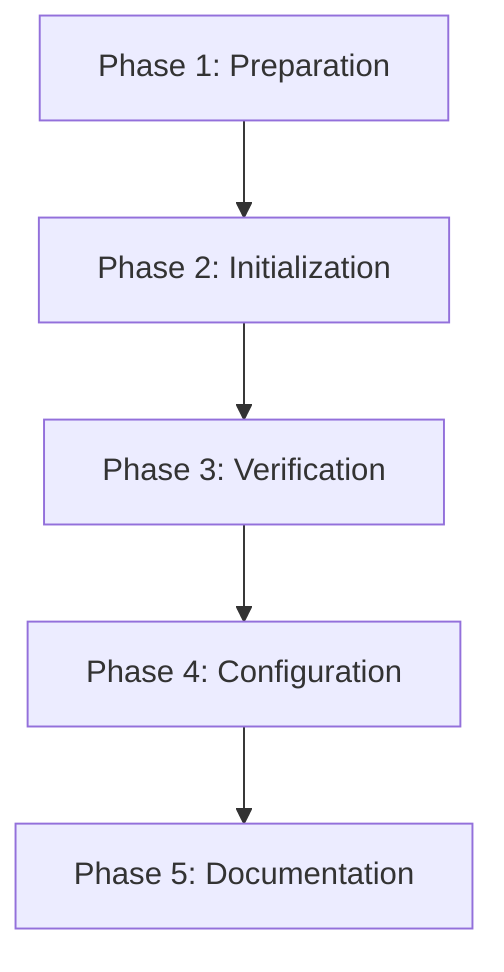

<!--
==============================================================================
DOCUMENT PURPOSE: Executable Tasks for M1: Nx Initialization
==============================================================================

This task list provides specific, actionable steps for implementing M1
(Nx Initialization) in the Backpack repository.

FOCUS: STEPS (What to do, in what order)
- Specific actions with file paths
- Commands to run
- Verification steps
- Execution order

AUTOMATION:
- Auto-generated by `/speckit.tasks` from M1 plan.md and spec.md
- Organized by implementation phase

VALIDATION:
- Each task should be executable independently (or with stated dependencies)
- Commands should be copy-pasteable
- Verification criteria should be clear
==============================================================================
-->

# Tasks: M1 - Nx Initialization

**Input**: Design documents from `/specs/003-nx-migration/`
**Prerequisites**: plan.md (M1 implementation plan), spec.md (M1 user story), M1-research.md

**Backpack Context**: This milestone initializes Nx in the Backpack monorepo without changing existing structure or workflows.

**Tests**: No new test files required for M1. Verification is done via command execution and existing test suite.

**Organization**: Tasks are grouped by implementation phase to enable clear progress tracking.

## Format: `[ID] [P?] Description`

- **[P]**: Can run in parallel (different files, no dependencies)
- Include exact file paths and commands

## Summary

| Phase | Task Count | Parallel Tasks |
|-------|------------|----------------|
| Phase 1: Preparation | 5 | 3 |
| Phase 2: Initialization | 4 | 0 |
| Phase 3: Verification | 6 | 4 |
| Phase 4: Configuration | 4 | 2 |
| Phase 5: Documentation | 4 | 3 |
| **Total** | **23** | **12** |

---

## Phase 1: Preparation

**Purpose**: Ensure clean starting state and verify environment

**⚠️ CRITICAL**: Must complete before running `npx nx@latest init`

- [x] T001 Create feature branch from main (using existing 003-nx-migration branch)
  ```bash
  git checkout main
  git pull origin main
  git checkout -b feat/nx-initialization
  ```
  **Verify**: `git branch` shows `feat/nx-initialization` as current branch

- [x] T002 Verify Node.js version meets requirements (>=18.20.4) ✓ v22.21.1
  ```bash
  node --version
  ```
  **Verify**: Output shows version 18.20.4 or higher

- [x] T003 Verify npm version meets requirements (>=10.7.0) ✓ v10.9.4
  ```bash
  npm --version
  ```
  **Verify**: Output shows version 10.7.0 or higher

- [x] T004 [P] Run baseline build to establish working state ✓
  ```bash
  npm run build
  ```
  **Verify**: Build completes with exit code 0

- [x] T005 [P] Run baseline tests to establish working state ✓ 330 suites, 1640 tests
  ```bash
  npm run test
  ```
  **Verify**: All tests pass, coverage thresholds met (70% branches, 75% functions/lines)

- [x] T006 [P] Run baseline typecheck to establish working state ✓
  ```bash
  npm run typecheck
  ```
  **Verify**: TypeScript compilation succeeds with no errors

**Checkpoint**: Environment verified, baseline established, ready for Nx initialization

---

## Phase 2: Nx Initialization

**Purpose**: Initialize Nx workspace with minimal configuration

**⚠️ CRITICAL**: Sequential execution required - each step depends on previous

- [x] T007 Run Nx initialization command ✓ Nx v22.4.2 installed with plugins
  ```bash
  npx nx@latest init
  ```
  **Prompts**:
  - "Enable distributed task execution?" → **No**
  - "Add Nx Cloud?" → **No**
  - "Wrap existing scripts?" → **Yes**

  **Verify**: Command completes without errors

- [x] T008 Verify `nx.json` was created at repository root ✓
  ```bash
  ls -la nx.json
  ```
  **Verify**: File exists at `/Users/chloehe/Documents/code/backpack/nx.json`

- [x] T009 Verify `nx` was added to devDependencies in `package.json` ✓ v22.4.2
  ```bash
  grep -A1 '"nx":' package.json
  ```
  **Verify**: Shows `"nx": "^X.X.X"` in devDependencies

- [x] T010 Verify package-lock.json was updated ✓
  ```bash
  grep -c '"nx"' package-lock.json
  ```
  **Verify**: Returns count > 0 (nx is in lockfile)

**Checkpoint**: Nx installed, basic configuration created

---

## Phase 3: Verification

**Purpose**: Verify Nx installation without disrupting existing workflows

**⚠️ CRITICAL**: All existing scripts MUST continue working unchanged

- [x] T011 Verify Nx version command works ✓ v22.4.2
  ```bash
  npx nx --version
  ```
  **Verify**: Outputs Nx version number (e.g., `21.0.0`)

- [x] T012 Verify dependency graph generation ✓
  ```bash
  npx nx graph
  ```
  **Verify**: Opens browser with dependency visualization (or outputs URL)

- [x] T013 [P] Verify `npm run build` still works ✓
  ```bash
  npm run build
  ```
  **Verify**: Build completes successfully, same output as baseline (T004)

- [x] T014 [P] Verify `npm run test` still works ✓ 330 suites, 1640 tests
  ```bash
  npm run test
  ```
  **Verify**: All tests pass, same results as baseline (T005)

- [x] T015 [P] Verify `npm run lint` still works ✓ (0 errors, 30 warnings)
  ```bash
  npm run lint
  ```
  **Verify**: Linting passes without errors

- [x] T016 [P] Verify `npm run typecheck` still works ✓
  ```bash
  npm run typecheck
  ```
  **Verify**: TypeScript compilation succeeds, same as baseline (T006)

- [x] T017 Verify `npm run storybook:dist` still works ✓ (using Nx plugin)
  ```bash
  npm run storybook:dist
  ```
  **Verify**: Storybook builds successfully to `dist-storybook/`

**Checkpoint**: All existing workflows verified working, Nx integration confirmed

---

## Phase 4: Configuration Refinement

**Purpose**: Optimize Nx configuration for Backpack's needs

- [x] T018 Review and update `nx.json` with recommended configuration ✓

  Update `/Users/chloehe/Documents/code/backpack/nx.json` to include:
  ```json
  {
    "$schema": "./node_modules/nx/schemas/nx-schema.json",
    "defaultBase": "main",
    "namedInputs": {
      "default": ["{projectRoot}/**/*", "sharedGlobals"],
      "sharedGlobals": [
        "{workspaceRoot}/babel.config.js",
        "{workspaceRoot}/tsconfig.json"
      ],
      "production": [
        "default",
        "!{projectRoot}/**/?(*.)+(spec|test).[jt]s?(x)",
        "!{projectRoot}/**/*.stories.tsx"
      ]
    },
    "targetDefaults": {
      "build": {
        "cache": true,
        "dependsOn": ["^build"],
        "inputs": ["production", "^production"]
      },
      "test": {
        "cache": true,
        "inputs": ["default", "^default"]
      },
      "lint": {
        "cache": true,
        "inputs": ["default"]
      }
    }
  }
  ```
  **Verify**: JSON is valid, no syntax errors

- [x] T019 [P] Update `.gitignore` to exclude Nx cache (if not already present) ✓ (already added by nx init)

  Add to `/Users/chloehe/Documents/code/backpack/.gitignore`:
  ```gitignore
  # Nx
  .nx/cache
  ```
  **Verify**: `.nx/cache` line exists in `.gitignore`

- [x] T020 [P] Verify Nx caching works after configuration ✓
  ```bash
  # Run build twice - second should be cached
  npm run build
  npm run build
  ```
  **Verify**: Second run shows cached results (significantly faster)

- [ ] T021 Simulate CI workflow to verify compatibility
  ```bash
  # Clean install and run CI workflow
  rm -rf node_modules packages/node_modules
  npm ci
  npm run build
  npm run typecheck
  npm run test
  ```
  **Verify**: All commands succeed in sequence

**Checkpoint**: Configuration optimized, caching verified, CI compatibility confirmed

---

## Phase 5: Documentation & Commit

**Purpose**: Document changes and prepare for merge

- [x] T022 [P] Add Nx migration documentation to repository ✓

  Create or update `/Users/chloehe/Documents/code/backpack/docs/nx-migration.md`:
  ```markdown
  # Nx Integration

  Backpack uses Nx for task orchestration and caching.

  ## Quick Start

  ```bash
  # View dependency graph
  npx nx graph

  # All existing npm scripts continue to work
  npm run build
  npm run test
  npm run lint
  ```

  ## Why Nx?

  - Faster CI with computation caching
  - Dependency graph visualization
  - Future: affected-based test execution (M5)

  ## Current Status

  - [x] M1: Nx Initialization (this milestone)
  - [ ] M2: Project Structure Confirmation
  - [ ] M3: Storybook Colocation
  - [ ] M4: Components as Nx Projects
  - [ ] M5: Static Checks via Nx
  - [ ] M6: Module Boundaries
  ```
  **Verify**: File exists and content is correct

- [x] T023 [P] Review all changed files before commit ✓
  ```bash
  git status
  git diff
  ```
  **Verify**: Only expected files changed:
  - `nx.json` (new)
  - `package.json` (modified - nx added)
  - `package-lock.json` (modified)
  - `.gitignore` (modified if updated)
  - `docs/nx-migration.md` (new)

- [ ] T024 [P] Commit changes with conventional commit message
  ```bash
  git add nx.json package.json package-lock.json .gitignore docs/nx-migration.md
  git commit -m "feat(tooling): initialize Nx workspace (M1)

  - Add nx.json configuration with caching for build, test, lint
  - Add nx to devDependencies
  - Update .gitignore to exclude .nx/cache
  - Add docs/nx-migration.md with usage instructions

  This is the first milestone of the Nx migration. All existing npm scripts
  continue to work unchanged. No breaking changes to consumers.

  Refs: UP-341"
  ```
  **Verify**: Commit created successfully

- [ ] T025 Push branch and create PR
  ```bash
  git push -u origin feat/nx-initialization
  ```

  Create PR with title: `feat(tooling): Initialize Nx workspace (M1)`

  PR Description:
  ```markdown
  ## Summary

  - Initialize Nx workspace with minimal configuration
  - Enable caching for build, test, and lint commands
  - Add dependency graph visualization (`npx nx graph`)

  ## Test plan

  - [ ] `npx nx --version` returns version number
  - [ ] `npx nx graph` displays dependency visualization
  - [ ] `npm run build` succeeds unchanged
  - [ ] `npm run test` passes (same results as main)
  - [ ] `npm run lint` passes (same results as main)
  - [ ] `npm run typecheck` passes (same results as main)
  - [ ] CI pipeline passes

  🤖 Generated with [Claude Code](https://claude.com/claude-code)
  ```
  **Verify**: PR created, CI pipeline triggered

**Checkpoint**: Changes committed, PR created, ready for review

---

## Dependencies & Execution Order

### Phase Dependencies



### Task Dependencies

| Task | Depends On | Blocks |
|------|------------|--------|
| T001-T003 | None | T004-T006 |
| T004-T006 | T001-T003 | T007 |
| T007-T010 | T006 | T011 |
| T011-T017 | T010 | T018 |
| T018-T021 | T017 | T022 |
| T022-T025 | T021 | None |

### Parallel Opportunities

**Phase 1**: T004, T005, T006 can run in parallel
**Phase 3**: T013, T014, T015, T016 can run in parallel
**Phase 4**: T019, T020 can run in parallel
**Phase 5**: T022, T023, T024 can run in parallel

---

## Success Criteria

Before merging, verify ALL of these pass:

- [ ] `nx.json` exists at repository root
- [ ] `npx nx --version` returns version number
- [ ] `npx nx graph` displays dependency visualization
- [ ] `npm run build` succeeds (same output as before M1)
- [ ] `npm run test` passes (same test count and coverage)
- [ ] `npm run lint` passes (no new errors)
- [ ] `npm run typecheck` passes (no new errors)
- [ ] `npm run storybook:dist` succeeds
- [ ] GitHub Actions CI pipeline passes
- [ ] No changes to consumer import paths (`@skyscanner/backpack-web/...`)

---

## Rollback Plan

If issues arise after merging:

```bash
# Immediate rollback
git checkout main -- package.json package-lock.json
rm nx.json
npm ci

# Or revert the merge commit
git revert <merge-commit-sha>
```

---

## Notes

- **No new tests required**: M1 is verified via existing test suite
- **Zero breaking changes**: All npm scripts work unchanged
- **Caching enabled**: Build, test, lint will benefit from Nx caching
- **Foundation for M2+**: This enables all subsequent milestones

## References

- **M1 Specification**: `specs/003-nx-migration/milestones/M1-nx-initialization.md`
- **M1 Research**: `specs/003-nx-migration/milestones/M1-research.md`
- **M1 Plan**: `specs/003-nx-migration/plan.md`
- **Nx Documentation**: [Adding Nx to Existing Project](https://nx.dev/docs/getting-started/start-with-existing-project)
