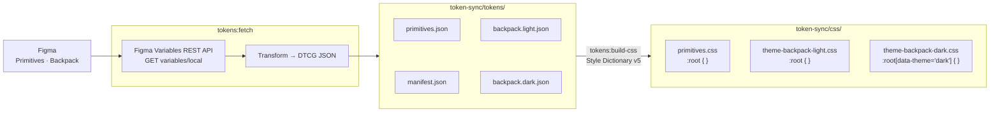

# token-sync

A small CLI that syncs design tokens from the Backpack Foundations & Components
Figma file into the Backpack codebase, in two stages:

**Figma variables → DTCG JSON → CSS custom properties.**



> Requires a Figma **Enterprise** org. Non-Enterprise accounts get `403` even with a valid token.

## Setup

### 1. Generate a Figma access token

Open <https://www.figma.com/settings> → **Security** → **Personal access tokens**, generate a new
token with the **Variables — Read-only** scope, and copy it (Figma only shows it once).

### 2. Store the token

The token is never committed. There are two places it needs to live:

- **Local dev** — copy `token-sync/.env.example` to `token-sync/.env` and fill in:

  ```
  FIGMA_VARIABLES_SYNC_TOKEN=<token from step 1>
  FIGMA_FILE_KEY=<Backpack Foundations & Components file key>
  ```

  `.env` is git-ignored.

- **CI** — add two repository secrets at **Settings → Secrets and variables → Actions**:

  | Secret name                  | Value                                      |
  | ---------------------------- | ------------------------------------------ |
  | `FIGMA_VARIABLES_SYNC_TOKEN` | Same token as above                        |
  | `FIGMA_FILE_KEY`             | Backpack Foundations & Components file key |

  Requires repo admin; only needs to be done once.

## Stage 1 — Figma → DTCG

Fetches the `Primitives` and `Backpack` collections from the Figma
[Variables REST API](https://www.figma.com/developers/api#variables) and writes
deterministic [DTCG](https://design-tokens.github.io/community-group/format/)
JSON files to `token-sync/tokens/`.

From the repo root:

```bash
npm install
npm run tokens:fetch
```

Output:

```text
token-sync/tokens/
├─ primitives.json      # raw colour/spacing/… literals
├─ backpack.light.json  # semantic tokens, Light mode
├─ backpack.dark.json   # semantic tokens, Dark mode
└─ manifest.json        # metadata: counts, roles, generatedAt
```

A scheduled workflow at `.github/workflows/sync-figma-variables.yml` runs the same two-stage
sync in CI. It is temporarily configured to run every 30 minutes for validation; the production
cadence will be daily at 18:00 GMT. It can also be triggered manually from
**Actions → Sync Figma variables → Run workflow**, with an optional file key override for testing.
It reads the Figma secrets from step 2, plus the `GH_APP_ID` repository variable and
`GH_APP_PRIVATE_KEY` secret for branch and pull request automation.

After fetching from Figma, the workflow checks `token-sync/tokens/` before building CSS. If there are
no token changes, or the only change is `manifest.json`'s `generatedAt` metadata, the workflow exits
cleanly without running the CSS build or creating a pull request.

When generated output changes under `token-sync/tokens/` or `token-sync/css/`, the workflow closes
any existing open `figma-token-sync/*` pull request, then creates a fresh
`figma-token-sync/<timestamp>-<run-id>` branch and opens one pull request against `main`. Because the
fresh branch is generated from the latest Figma state against `main`, it includes any still-unmerged
token changes from previous sync runs. Generated DTCG tokens include Figma variable metadata under
`$extensions.figma`, allowing the workflow to compare stable Figma variable keys across runs. The
pull request is labelled `major` when an existing Figma variable key is removed, renamed, or has its
emitted token value changed (because consumer code or downstream visuals may break), and `minor`
only when the diff is purely additive (new Figma variable keys). Deleted, renamed, changed, and added
token paths are listed in the pull request body so reviewers can verify usage migrations and visual
impact. If release label classification fails, the pull request defaults to `major` for review.
Figma API or Style Dictionary failures fail the workflow at the failing step.

For human takeover (when the automated PR needs to be replaced with a hand-curated one), see the
"Manual intervention" section in [`RUNBOOK.md`](RUNBOOK.md).

### How it works

- Calls `GET /v1/files/{file_key}/variables/local` with the `X-Figma-Token` header.
- Filters the response to the two target collections: `Primitives` and `Backpack`.
- Keeps only locally-authored collections (drops any `remote: true` Library-subscription copies
  — those are read-only snapshots of the last publish and would duplicate the working state).
- Cross-collection aliases (semantic → primitive) are preserved as DTCG
  references like `{Colour.Pink}`; same-collection aliases (semantic →
  semantic) are inlined to their final literal value.
- Unresolved aliases are skipped and reported in the console summary, along
  with any path collisions, missing-mode values, or invalid names.

Errors (missing env / bad token / wrong file key) exit with a hint that points to the right
place depending on whether you're running locally or in CI.

### Validation and debugging

For the repeatable end-to-end validation process and basic failure triage, see
[`RUNBOOK.md`](RUNBOOK.md).

## Stage 2 — DTCG → CSS

[Style Dictionary](https://styledictionary.com/) v5 reads the DTCG files above
and emits one CSS file per theme plus a theme-independent primitives sheet to
`token-sync/css/`.

From the repo root, **after** running Stage 1:

```bash
npm run tokens:build-css
```

Output:

```text
token-sync/css/
├─ primitives.css               # :root                    { --bpk-spacing-…: <value>; … }
├─ theme-backpack-light.css     # :root                    { --bpk-…: <light value>; }
└─ theme-backpack-dark.css      # :root[data-theme="dark"] { --bpk-…: <dark value>;  }
```

Apply dark mode by setting `data-theme="dark"` on `<html>` or `<body>`.

`primitives.css` carries Spacing and Radius only. Color primitives are
excluded (semantic tokens are the public colour API). Heights are excluded
until there is a confirmed consumer need. Import `primitives.css` once,
alongside whichever theme sheets you use.

### Things worth knowing

- **Light is the default theme; additional themes layer on top.** The default
  (Light) is emitted under `:root`; every additional theme (Dark today, plus
  any future experimental themes) is emitted under `:root[data-theme="<mode>"]`.
  Symmetry between the default and every additional theme is enforced — a
  token declared in one but missing in another will abort the build. Fix it
  in Figma by adding the missing path to the theme that's lacking it.
- **`Component` prefix is renamed to `private`.** `Component.Badge.Colour.bg-default`
  becomes `--bpk-private-badge-colour-bg-default`. The rename signals that these
  tokens are component internals — they ship in CSS but are not part of the
  public semantic API consumers should target. If two tokens collide on the same
  CSS variable name after kebab-casing — whether within a single file or across
  `primitives.css` and the per-theme files (both emit under `:root`) — the build
  refuses and tells you which ones to rename in Figma.
- **iOS/Android tokens are excluded from all CSS outputs.** Tokens whose path
  contains a standalone `ios` or `android` segment (case-insensitive) are dropped.
  They remain in the shared DTCG JSON for cross-platform parity.
- **Non-`px` dimensions abort the build.** Every `$type: dimension` value must
  be `Xpx` (e.g. `"16px"`) or a DTCG alias; other units or bare numbers are
  rejected so they can't be silently miscalculated during `px → rem` conversion
  (base: `1rem = 16px`).
- **The CSS lives outside `token-sync/tokens/`** so Stage 1's directory wipe
  doesn't clobber it.

### Adding a new theme

Both stages are theme-agnostic — adding a third theme (e.g. Sepia) requires **no code changes**:

1. Add the mode to the `Backpack` collection in Figma and assign every semantic token a value for it.
2. Run `npm run tokens:sync`.

Stage 1 emits `backpack.<mode>.json`; Stage 2 picks it up automatically and writes `theme-backpack-<mode>.css` with selector `:root[data-theme="<mode>"]`.

Only edit code if the Figma mode name shouldn't be used verbatim — add a `Figma name → output name` entry to `MODE_NAME_OVERRIDES` in `src/sync-helpers.ts` (e.g. Figma's `Day`/`Night` → `Light`/`Dark`).

### Overriding paths

`DTCG_OUTPUT_DIR` and `CSS_OUTPUT_DIR` can be set to absolute paths if the
default layout doesn't suit your build pipeline.

### Combined sync + build

```bash
npm run tokens:sync
```
